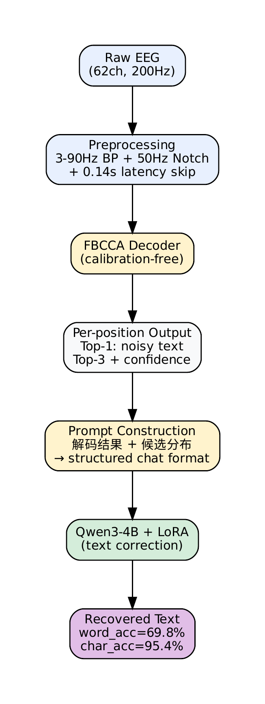

# Calibration-Free SSVEP-BCI Spelling via LLM-Augmented Frequency Decoding

FBCCA 2s + Qwen3-4B LoRA achieves **69.8% word accuracy** and **95.4% character accuracy** on a 40-target SSVEP speller — surpassing calibrated eTRCA 3s (64.6%) while requiring **zero per-subject calibration**.

<p align="center">
  
</p>

## Core Results

Comprehensive comparison across all decoder configurations. Word-level metrics are 3-seed averages. ITR in bits/min (Wolpaw formula, gaze_shift=0.5s). **Cal** = per-subject calibration required.

| Method | Duration | Trial Acc | ITR | Word Acc (%) | Char Acc (%) | Avg ED | Cal |
|--------|----------|-----------|-----|--------------|--------------|--------|-----|
| CCA | 1.0 s | 45.6% | 58.0 | 0.6±0.2 | 46.6±1.1 | 10.34±0.22 | No |
| FBCCA | 1.0 s | 49.9% | 67.0 | 1.0±0.3 | 48.1±0.7 | 10.05±0.16 | No |
| FiLM | 1.0 s | 65.8% | 103.5 | 7.5±0.2 | 65.7±1.0 | 6.63±0.23 | No\* |
| FBCCA+LLM | 1.0 s | — | 117.2† | 24.4±1.2 | 71.2±0.8 | 4.35±0.14 | No |
| eTRCA | 1.0 s | 77.4% | 134.2 | 42.0±1.1 | 78.8±0.9 | 4.11±0.17 | Yes |
| CCA | 2.0 s | 72.7% | 72.8 | 30.2±1.3 | 74.2±0.8 | 4.99±0.15 | No |
| FBCCA | 2.0 s | 84.3% | 92.7 | 45.7±0.6 | 86.0±0.2 | 2.71±0.04 | No |
| eTRCA | 2.0 s | 86.4% | 96.8 | 53.7±0.5 | 87.6±0.3 | 2.40±0.06 | Yes |
| FiLM | 2.0 s | 88.3% | 100.4 | 54.0±2.6 | 87.3±0.7 | 2.46±0.14 | No\* |
| **FBCCA+LLM** | **2.0 s** | **—** | **115.4†** | **69.8±0.2** | **95.4±0.1** | **0.70±0.01** | **No** |
| CCA | 3.0 s | 79.5% | 60.2 | 43.8±0.7 | 81.5±0.6 | 3.58±0.12 | No |
| FBCCA | 3.0 s | 89.4% | 73.3 | 51.9±1.4 | 91.3±0.1 | 1.69±0.02 | No |
| eTRCA | 3.0 s | 91.9% | 76.9 | 64.6±0.8 | 93.7±0.2 | 1.22±0.03 | Yes |

\*FiLM = REVE(9ch, frozen) + FiLM(FBCCA) + LoRA(r=16), no per-subject calibration but requires cross-subject training data.
†Effective ITR via Method B: P_eff = 1 − avg_ed/L, V2 data L≈15.

**Key findings:**
- **FBCCA 2s + LLM** achieves the highest word accuracy across all methods and durations, surpassing calibrated eTRCA 3s by +5.2 pp — with zero calibration
- Effective ITR of 115.4 bits/min exceeds all 2s and 3s baselines
- LLM correction is equivalent to doubling stimulation duration: FBCCA 1s + LLM (24.4%) ≈ CCA 2s (30.2%)
- FiLM 2s ≈ eTRCA 2s at word level (54.0% vs 53.7%), establishing FiLM as a strong calibration-free baseline
- avg_ed = 0.70 means less than 1 character error per word on average

## Environment Setup

**Requirements:** Python 3.11, [uv](https://docs.astral.sh/uv/) package manager

```bash
# Clone and install
git clone https://github.com/<your-org>/REVE_Qwen.git
cd REVE_Qwen
uv sync
```

**Key dependencies** (resolved automatically by `uv sync`):
- PyTorch ≥ 2.1.0
- Transformers ≥ 4.45.0
- PEFT ≥ 0.13.0
- DeepSpeed ≥ 0.15.0
- braindecode ≥ 1.3.0 (for REVE model loading)
- MNE ≥ 1.6.0 (EEG preprocessing)
- scipy, numpy, einops

**Hardware:**
- Training: 5× NVIDIA RTX 4090 (48 GB each), CUDA devices 3–7
- Inference / evaluation: 1× GPU with 16 GB+ VRAM

## Datasets

### Source

Two publicly available 40-target SSVEP-BCI datasets:

| Dataset | Subjects | Channels | Sampling Rate | Blocks/Subj | Trials/Block | Total Trials |
|---------|----------|----------|---------------|-------------|-------------|-------------|
| Tsinghua Benchmark | S01–S35 (35) | 64 EEG @ 250 Hz | 250 Hz | 6 | 40 | 8,400 |
| BETA | S01–S70 (70) | 64 EEG @ 250 Hz | 250 Hz | 4 | 40 | 11,200 |

**Download:** http://bci.med.tsinghua.edu.cn/download.html

Place downloaded files in `data/Benchmark/` and `data/BETA/`, then extract:

```bash
bash scripts/extract_data.sh
```

### Train/Val Split

Training and validation use strictly separate subjects (zero overlap):

| Dataset | Split | Subjects | Trials |
|---------|-------|----------|--------|
| Benchmark | Train | S01–S30 (30) | 7,200 |
| Benchmark | Val | S31–S35 (5) | 1,200 |
| BETA | Train | S01–S60 (60) | 9,600 |
| BETA | Val | S61–S70 (10) | 1,600 |
| **Total** | **Train** | **90** | **16,800** |
| **Total** | **Val** | **15** | **2,800** |

**Excluded subjects:** 5 BETA subjects with near-random FBCCA accuracy (<30%): S11, S41, S55, S59, S64.

### Preprocessing

```
Raw 250 Hz EEG
  → 3–90 Hz bandpass + 50 Hz notch filter
  → Remove CB1/CB2 electrodes (not in REVE position bank) → 62 channels
  → Remove 0.5 s visual cue period (125 samples @ 250 Hz)
  → Resample to 200 Hz
  → Truncate/zero-pad to 600 timepoints (3 s effective stimulus)
```

Signal-processing decoders additionally skip 0.14 s (28 samples @ 200 Hz) SSVEP transient response at stimulus onset.

## Methods

### CCA / FBCCA — Calibration-Free Frequency Baselines

**Source:** `src/fbcca.py`

CCA correlates multi-channel EEG with sinusoidal reference templates at each of 40 target frequencies (8.0–15.8 Hz). FBCCA extends this with 5 sub-band filters ({6–90, 14–90, 22–90, 30–90, 38–90} Hz), combining correlations via weighted sum. Both are calibration-free, GPU-accelerated, and require no training data.

### eTRCA — Calibration-Dependent Upper Bound

**Source:** `src/trca.py`

Ensemble filter bank TRCA learns data-driven spatial filters from per-subject calibration trials via leave-one-block-out cross-validation. Uses all 40 spatial filters per target (ensemble mode), achieving the highest per-trial accuracy but requiring 4–6 minutes of calibration per subject.

### FiLM-REVE-LoRA — Calibration-Free Neural Classifier

<p align="center">
  
</p>

**Source:** `src/film_classifier.py`, `src/encoder_film.py`

Combines three components:
1. **REVE backbone** (69.2M params, frozen): 22-layer Transformer EEG foundation model, pretrained on 60k+ hours across 92 datasets. Processes 9 occipital channels (Oz, O1, O2, POz, PO3, PO4, PO7, PO8, Pz) at 200 Hz
2. **FiLM modulation**: FBCCA 200-dim features → LayerNorm → Linear(200→512) for γ/β → tanh scaling (scale=0.1) → H' = γ⊙H + β. Initialized to identity (γ=0, β=0)
3. **LoRA adaptation** (r=16, α=32): Applied to REVE attention layers (to_qkv + to_out), 44 adapters, 1.08M trainable params
4. **Attention pooling** → Linear(512, 40) classification head

Total: 70.5M params, 1.31M trainable (1.9%). Requires cross-subject training data but no per-subject calibration.

### FBCCA + LLM — Two-Stage Text Correction (Proposed)

<p align="center">
  
</p>

**Source:** `scripts/generate_correction_data.py`, `scripts/train_correction.py`, `scripts/eval_correction.py`

A pure text-to-text approach with no EEG embeddings:

1. **Stage 1 — FBCCA decoding:** For each character position, FBCCA produces top-3 candidate characters with normalized confidence scores
2. **Stage 2 — LLM correction:** Qwen3-4B-Instruct + LoRA (r=16, α=32, dropout=0.05) receives structured input containing the FBCCA decoded text and per-position candidates, then outputs the corrected word

**Input format example:**
```
解码结果: "HFLP"
候选:
  位置1: H(0.45) G(0.30) P(0.25)
  位置2: F(0.38) E(0.35) N(0.27)
  位置3: L(0.52) K(0.28) T(0.20)
  位置4: P(0.60) O(0.22) Q(0.18)
```

**Training data** is generated from real FBCCA decoder outputs (not synthetic noise), ensuring the LLM learns authentic error patterns. Three dialogue types:

| Type | Description | V2 Ratio | Purpose |
|------|-------------|----------|---------|
| A (Spelling) | Candidates → correct word | 70% | Core spelling correction |
| C (Correction) | Corrupted candidates → error detection | 20% | Error awareness |
| D (Dialogue) | Natural language interaction | 10% | Preserves conversational ability |

**Training config:** Effective batch 40 (4/device × 5 GPUs × 2 grad_accum), lr=2e-4 cosine, 10 epochs, bf16, ~10M trainable params (~0.25% of 4B).

## Reproduction Steps

### Step 1: Data Download and Preprocessing

```bash
# Download from http://bci.med.tsinghua.edu.cn/download.html
# Place files in data/Benchmark/ and data/BETA/

# Extract archives
bash scripts/extract_data.sh

# Preprocess EEG (bandpass, notch, resample, channel selection)
uv run python -c "
from src.preprocess import preprocess_all
preprocess_all('data/benchmark_raw', 'data/beta_raw', 'data/eeg_tensors')
"
```

### Step 2: FBCCA / eTRCA Precomputation

```bash
# Precompute FBCCA top-3 for all durations
uv run python scripts/precompute_fbcca.py

# Precompute eTRCA (ensemble mode, leave-one-block-out)
uv run python scripts/precompute_trca.py --ensemble
```

### Step 3: Baseline Evaluation (CCA / FBCCA / eTRCA)

```bash
# Evaluate all signal-processing decoders at 1s, 2s, 3s
uv run python scripts/eval_baselines.py
uv run python scripts/eval_baselines.py --decoder_pts 200 400 600
```

### Step 4: FiLM Training and Evaluation

```bash
# Train FiLM classifier (1s and 2s)
uv run python scripts/finetune_film.py --trial_pts 200 --output_dir output_film/film_200_lora16
uv run python scripts/finetune_film.py --trial_pts 400 --output_dir output_film/film_400_lora16

# Evaluate word-level spelling
uv run python scripts/eval_film_spelling.py \
    --checkpoint output_film/film_200_lora16/best_model.pt \
    --checkpoint2 output_film/film_400_lora16/best_model.pt
```

### Step 5: LLM Correction Data Generation

```bash
# Generate training data from real FBCCA outputs (v2 format)
# 1s data
uv run python scripts/generate_correction_data.py \
    --eeg_dir data/eeg_tensors \
    --output_dir data/correction \
    --decoder_pts 200 \
    --n_type_a 7000 --n_type_c 2000 --n_type_d 1000

# 2s data
uv run python scripts/generate_correction_data.py \
    --eeg_dir data/eeg_tensors \
    --output_dir data/correction_2s \
    --decoder_pts 400 \
    --n_type_a 7000 --n_type_c 2000 --n_type_d 1000
```

### Step 6: LLM LoRA Training

```bash
# Train on 5×4090 (adjust CUDA_VISIBLE_DEVICES as needed)
CUDA_VISIBLE_DEVICES=3,4,5,6,7 bash scripts/train_correction.sh

# For 2s model, override data_dir:
CUDA_VISIBLE_DEVICES=3,4,5,6,7 bash scripts/train_correction.sh \
    --data_dir data/correction_2s \
    --output_dir output/correction_2s
```

### Step 7: LLM Evaluation (3-seed)

```bash
# 1s model, multi-seed evaluation
CUDA_VISIBLE_DEVICES=3 bash scripts/eval_correction_multiseed.sh \
    --checkpoint output/correction/final \
    --decoder_pts 200 --batch_size 64

# 2s model, multi-seed evaluation
CUDA_VISIBLE_DEVICES=3 bash scripts/eval_correction_multiseed.sh \
    --checkpoint output/correction_2s/checkpoint-1500 \
    --decoder_pts 400 --batch_size 64
```

## Project Structure

```
REVE_Qwen/
├── main_bci_agent.py              # BCI agent entry point (interactive mode)
├── pyproject.toml                 # Dependencies (uv)
│
├── src/                           # Core modules
│   ├── fbcca.py                   # GPU-accelerated CCA / FBCCA decoder
│   ├── trca.py                    # TRCA / eTRCA spatial filter decoder
│   ├── preprocess.py              # EEG preprocessing (bandpass, resample)
│   ├── encoder_film.py            # FiLM modulation layer
│   ├── film_classifier.py         # FiLM-REVE-LoRA classifier
│   ├── encoder_labram.py          # LaBraM encoder wrapper
│   ├── reve_classifier.py         # REVE standalone classifier
│   ├── model_bci_agent.py         # LLaVA-style BCI agent model
│   ├── model_e2e.py               # End-to-end model
│   ├── dataset_bci_agent.py       # BCI agent dataset (Stage 1/2)
│   ├── dataset_bci_candidate.py   # Candidate injection dataset
│   ├── dataset_reve_finetune.py   # REVE fine-tuning dataset
│   ├── train_bci_agent.py         # BCI agent training logic
│   ├── metrics_bci_agent.py       # BCI metrics (acc, top5, two-step)
│   ├── templates_zh.py            # Chinese prompt templates
│   ├── tokens.py                  # Special token definitions
│   └── word_vocab.py              # Word vocabulary for Stage 2
│
├── scripts/                       # Training, evaluation, and utilities
│   ├── extract_data.sh            # Dataset extraction
│   ├── precompute_fbcca.py        # FBCCA top-3 precomputation
│   ├── precompute_trca.py         # eTRCA precomputation
│   ├── eval_baselines.py          # CCA/FBCCA/eTRCA baseline evaluation
│   ├── finetune_film.py           # FiLM classifier training
│   ├── eval_film_spelling.py      # FiLM word-level spelling evaluation
│   ├── generate_correction_data.py # LLM training data generation
│   ├── train_correction.py        # LLM LoRA training
│   ├── train_correction.sh        # LLM training launcher (multi-GPU)
│   ├── eval_correction.py         # LLM evaluation
│   ├── eval_correction_multiseed.sh # 3-seed evaluation
│   ├── ssvep_sensitivity.py       # Per-subject SSVEP quality analysis
│   ├── eval_per_subject.py        # Per-subject evaluation
│   ├── loso_film.py               # Leave-one-subject-out cross-validation
│   ├── run_loso.sh                # LOSO launcher
│   ├── clean_bad_folds.sh         # Clean failed LOSO folds
│   ├── train_ablation.sh          # Ablation study runner
│   ├── train_bci_agent_s1.sh      # BCI agent Stage 1 training
│   ├── train_bci_agent_s2.sh      # BCI agent Stage 2 training
│   ├── train_single_gpu.sh        # Single-GPU training helper
│   └── tensorboard.sh             # TensorBoard launcher
│
├── configs/                       # DeepSpeed configurations
│   ├── ds_zero2.json
│   ├── ds_zero2_simple.json
│   └── ds_zero3_offload.json
│
├── figures_arch/                  # Architecture diagrams
│   ├── pipeline-1.png             # Overall two-stage pipeline
│   ├── film_reve_paper-1.png      # FiLM-REVE-LoRA architecture
│   └── qwen_lora_paper-1.png      # FBCCA+LLM architecture
│
├── docs/plans/                    # Design documents
│   ├── 2026-02-06-bci-qwen-lora-design.md
│   └── 2026-02-08-interactive-bci-agent-design.md
│
├── tests/
│   └── test_pipeline.py           # Pipeline integration tests
│
└── paper_draft.md                 # Full paper manuscript
```

## Citations

If you use this work, please cite:

```bibtex
@article{reve2025,
  title={REVE: A Foundation Model for EEG Analysis},
  author={Kostas, Andrei and Aroca-Ouellette, Stephane and Bhatt, Feryal},
  journal={Advances in Neural Information Processing Systems},
  year={2025}
}

@article{qwen3,
  title={Qwen3 Technical Report},
  author={{Qwen Team}},
  journal={arXiv preprint arXiv:2505.09388},
  year={2025}
}

@article{benchmark2017,
  title={A benchmark dataset for SSVEP-based brain-computer interfaces},
  author={Wang, Yijun and Chen, Xiaogang and Gao, Xiaorong and Gao, Shangkai},
  journal={IEEE Transactions on Neural Systems and Rehabilitation Engineering},
  volume={25},
  number={10},
  pages={1746--1752},
  year={2017}
}

@article{beta2020,
  title={BETA: A large benchmark database toward SSVEP-BCI application},
  author={Liu, Bingchuan and Huang, Xiaoshan and Wang, Yijun and Chen, Xiaogang and Gao, Xiaorong},
  journal={Frontiers in Neuroscience},
  volume={14},
  pages={627},
  year={2020}
}

@article{fbcca2015,
  title={Filter bank canonical correlation analysis for implementing a high-speed SSVEP-based brain-computer interface},
  author={Chen, Xiaogang and Wang, Yijun and Gao, Shangkai and Jung, Tzyy-Ping and Gao, Xiaorong},
  journal={Journal of Neural Engineering},
  volume={12},
  number={4},
  pages={046008},
  year={2015}
}

@article{trca2018,
  title={Enhancing detection of SSVEPs for a high-speed brain speller using task-related component analysis},
  author={Nakanishi, Masaki and Wang, Yijun and Chen, Xiaogang and Wang, Yu-Te and Gao, Xiaorong and Jung, Tzyy-Ping},
  journal={IEEE Transactions on Biomedical Engineering},
  volume={65},
  number={1},
  pages={104--112},
  year={2018}
}

@article{lora2021,
  title={LoRA: Low-Rank Adaptation of Large Language Models},
  author={Hu, Edward J. and Shen, Yelong and Wallis, Phillip and Allen-Zhu, Zeyuan and Li, Yuanzhi and Wang, Shean and Wang, Lu and Chen, Weizhu},
  journal={arXiv preprint arXiv:2106.09685},
  year={2021}
}
```
